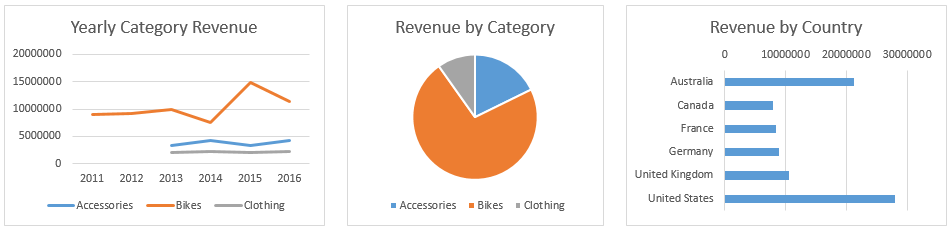

# Data: first overview

**Scenario.** You are the new marketing manager of an established Bicycle company. The company sells bicycles and accessories, such as clothing and other accessories to bikers in six countries. The company has just hired Lucy as its new Sales manager. You are tasked to introduce Lucy to the company, its product portfolio and its sales performance since 2011. To do this, you have asked Jack, the IT manager to prepare some data for you. Now, it's your job to present this data in a compelling manner.  
  
Load necessary libraries:
```{r results='hide'}
library(tidyverse)
library(readxl)
library(DT)
library(RColorBrewer)
```
Load raw data from **Lab2Start.xlsx** file:
```{r my_data, cache.extra = file.info("./data/raw/raw_data.xlsx")}
my_data <- read_excel("./data/raw/raw_data.xlsx")
```
Let's view structure of our data:  
```{r}
str(my_data)
```
To see how our raw data looks like we use `datatable()` function from `DT` package:  
```{r}
datatable(my_data[1:100, ],
          class = "cell-border stripe nowrap",
          options = list(scrollX = T, dom = 'tp', autoWidth = TRUE,
                         columnDefs = list(list(className = 'dt-body-center', targets = "_all")))) %>%
     formatDate(1, method = "toDateString")
```

---

The first thing you'd like to do is to present the data graphically. You do this by creating charts for the three groups of data you received from Jack, your IT manager. If you haven't done so, give the chart a descriptive title.  

Your first solution should look like this (numbers may not be the same).

Create three type of chart as showed above and answer the next questions.  

---

## What does the yearly total sales look like?  
```{r}
my_data %>%
    group_by(Year, `Product Category`) %>%
    summarise(Total = sum(Revenue)) %>%
    ggplot(aes(x = Year, y = Total, color = reorder(`Product Category`, -Total))) +
    geom_line(size = 1.2) +
    geom_point(size = 2) +
    scale_y_continuous(limits = c(0, 15e6), expand = c(0, 0), labels = scales::dollar) +
    labs(title = "Total Yearly Sales by Category", x = NULL, y = NULL, color = NULL) +
    scale_fill_brewer(palette = "Dark2") +
    theme_classic() +
    theme(plot.title = element_text(face = "bold", hjust = 0.5),
          panel.grid.major = element_line(colour = "gray"),
          panel.grid.minor = element_line(colour = "gray", size = 0.1),
          #legend.title = element_text(face = "bold", colour = "black", size = 12),
          legend.text = element_text(size = 11, color = "black"),
          axis.text = element_text(size = 11, colour = "black"),
          axis.title = element_text(size = 12, face = "bold"))
```

**Answer:** Similar to the yearly bikes revenue   

---

## What percentage of the total revenue comes from the bikes category?   
```{r}
my_data %>%
    group_by(`Product Category`) %>%
    summarise(Total = sum(Revenue)) %>%
    arrange(desc(Total)) %>%
    mutate(Prop = formatC(Total / sum(Total), digits = 2, format = "f") %>%
               as.numeric(),
           Percent = paste(Prop * 100, "%"),
           y_tick = cumsum(Prop) - Prop / 2) %>%
    ggplot(aes(x = "", y = Prop, fill = reorder(`Product Category`, -Prop))) +
    geom_bar(width = 1, stat = "identity", colour = "white", size = 0.7) +
    coord_polar(theta = "y") +
    labs(title = "Revenue by Category", x = NULL, y = NULL) +
    geom_text(aes(x = c(1.0, 1.2, 1.3), y = 1 - y_tick, label = Percent), size = 5) +
    scale_fill_brewer(palette = "Set2") +
    theme(panel.background = element_rect(fill = "white", color = "white"),
          plot.title = element_text(face = "bold", hjust = 0.5),
          legend.title = element_blank(),
          legend.text = element_text(size = 10, color = "black"),
          axis.text = element_blank(),
          axis.ticks = element_blank(),
          axis.line = element_blank())
```

**Answer:** 72%  

---

## For the revenue by country, sort the countries from the one with highest revenue to lowest revenue   
```{r}
my_data %>%
    group_by(Country) %>%
    summarise(Total = sum(Revenue)) %>%
    ggplot(aes(x = reorder(Country, Total), y = Total)) +
    geom_bar(stat = "identity", width = .5, fill = "tomato2") +
    scale_y_continuous(labels = scales::dollar, expand = c(0.01, 0)) +
    scale_x_discrete(expand = c(0.01, 0)) +
    coord_flip() +
    labs(title = "Total revenue by country", y = NULL, x = NULL) +
    theme_classic() +
    theme(panel.background = element_rect(fill = "white", color = "white"),
          plot.title = element_text(face = "bold", hjust = 0.5),
          axis.text = element_text(size = 11, colour = "black"),
          axis.title = element_text(size = 12, face = "bold"))
    ```
