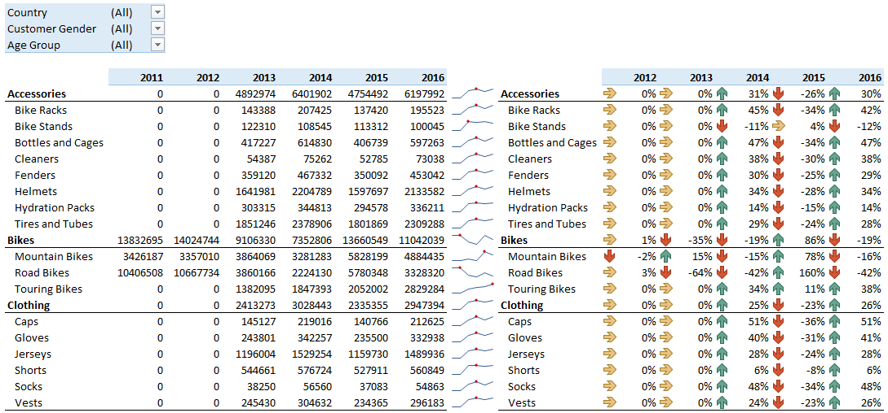

<style type="text/css">
@import url("css/custom_lab6.css");
</style>

# Lab7: Scenario

Lucy seems intrigued your presentation on Australia's sales. Now, she wants to review the sales difference (growth) for **Product Category** and **Sub Category** between year 2015 and 2016. She wants to be able to filter the report by all the options available, including **Customer Gender** and **Age Group**.  
  
Load libraries
```{r}
library(tidyverse, warn.conflicts = F)
library(scales)
library(formattable)
library(htmlwidgets)
library(sparkline)
```
Load data for this lab:
```{r}
my_data <- readRDS("./data/processing/data4week3.rds")
str(my_data)
```

In this Lab we'll be review the sales difference (growth) for **Product Category** and **Sub Category** between year 2015 and 2016. So, we will create two type of reports. One with the sales for each year and the other with the **% Change in Revenue** from year to year. Each report is a cross-tabular format with **Product Categories** and **Sub categories** on the rows and year on the columns, with **Sum of Revenue** as the aggregate data. Also we will create chart representation for each report.

Let's start! First, create two reports just like on picture below


    
For this task we're going to use such packages as [formattable](https://github.com/renkun-ken/formattable) and [sparklines](https://github.com/htmlwidgets/sparkline). Also we'll include external [css]("custom.css") file for styling our tables.

---  
  
## Helper functions for type 1 report

### Count totals for Product Category
```{r}
product_total <- function(df) {
  df %>%
    group_by(`Product Category`, Year) %>%
    summarise(Total = sum(Revenue)) %>%
    mutate(Margin = (Total - lag(Total)) / Total) %>% 
    ungroup() %>% 
    mutate(`Sub Category` = `Product Category`) %>% 
    select(`Product Category`, `Sub Category`, everything())
}
```
```{r echo=FALSE}
my_data %>% product_total() %>% kable()
```
### List of unique product in Product Category
```{r}
uniq_product <- function(df) {
  unique(df$`Product Category`)
}
my_data %>% uniq_product()
```
### Count totals for Sub Category:
```{r}
sub_total <- function(df) {
  df %>% 
  group_by(`Product Category`, `Sub Category`, Year) %>%
  summarise(Total = sum(Revenue)) %>%
  mutate(Margin = (Total - lag(Total)) / Total) %>% 
  ungroup()
}
```
```{r echo=FALSE}
my_data %>%
  sub_total() %>% 
  slice(1:10) %>% 
  kable()
```

### Prepare report_1
```{r}
report_1 <- function(df) {
  bind_rows(product_total(df), sub_total(df)) %>% 
  select(-Margin) %>% 
  group_by(`Product Category`, Year) %>% 
  spread(key = Year, value = Total) %>% 
  group_by(`Product Category`) %>% 
  arrange(desc(`2016`), .by_group = TRUE) %>% 
  ungroup() %>% 
  select(-`Product Category`) %>% 
  mutate_if(is.numeric, formattable::comma, digits = 0)
}
my_data %>% report_1
```

### Define function that makes sparklines in formattable object
```{r}
my_sparkline <- function(x){
  as.character(
    htmltools::as.tags(
      sparkline(x) # we can add any chart type!
    )
  )
}
```
### Make tibble with sparklines as html-widgets:
```{r}
sparkl_df <- function(df) {
  report_1(df) %>% 
  nest(`2011`:`2016`, .key = 'Sparkl') %>% 
  mutate_at('Sparkl', map, as.numeric, my_sparkline) %>% 
  mutate_at('Sparkl', map, my_sparkline)
}
```
### Add sparklines objects to report_1:
```{r}
report_1_sparkl <- function(df) {
  bind_cols(report_1(df), sparkl_df(df) %>%
                        select(Sparkl))
}
my_data %>% report_1_sparkl
```
### Final table for the first report
```{r}
report_1_table <- function(df) {
  formattable(report_1_sparkl(df),
    align = c("l", "r", "r", "r", "r", "r", "r"), table.attr = "class=\'my_table\'",
    list(
      area(, `2011`:`2016`) ~ color_tile("#FFFF00", "#FF0000"),
      `Sub Category` = formatter("span",
               style = x ~ ifelse(x %in% uniq_product(df), 
                            style(font.weight = "bold"),
                            style(padding.left = "0.25cm"))
                                )
        )
    ) %>% 
  formattable::as.htmlwidget() %>% 
  htmltools::tagList() %>%
  htmltools::attachDependencies(htmlwidgets:::widget_dependencies("sparkline","sparkline")) %>%
  htmltools::browsable()
}
my_data %>% report_1_table()
```

---

## Helper functions for report type 2

### Calculate changes in totals by year for product category
```{r}
report_2 <- function(df) {
  bind_rows(product_total(df), sub_total(df)) %>% 
  select(-Total) %>% 
  group_by(`Product Category`, Year) %>% 
  spread(key = Year, value = Margin) %>% 
  ungroup() %>% 
  arrange(match(`Sub Category`, report_1(df)$`Sub Category`)) %>% 
  select(-`Product Category`, -`2011`) %>% 
  mutate_if(is.numeric, formattable::percent, digits = 1)
}
my_data %>% report_2
```
### Final table for the second report
```{r}
report_2_table <- function(df) {
  formattable(report_2(df), align = c("l", "l", "l", "l", "l", "l"),
    table.attr = "class=\'my_table\'",
    list(
      area(, `2012`:`2016`) ~ formatter("span",
        style = x ~ style(color = ifelse(x < 0 , "red", "green")),
                x ~ icontext(ifelse(x < 0, "arrow-down", "arrow-up"), formattable::percent(x, digits = 1))),
     `Sub Category` = formatter("span",
                style = x ~ ifelse(x %in% uniq_product(df),
                           style(font.weight = "bold"),
                           style(padding.left = "0.25cm")
                                  )
                                )
      )
  )
}
my_data %>% report_2_table()
```

---

## Questions

### Without applying any filter, which year does the Accessories category have negative growth?

**Answer:** 2015

---

### Filter the reports for youth age group. Which two years do the accessories category have negative growth?
**Report 1**
```{r}
my_data %>%
  filter(`Age Group` == "Youth") %>%
  report_1_table()
```
**Report 2**
```{r}
my_data %>%
  filter(`Age Group` == "Youth") %>%
  report_2_table()
```
**Answer:** 2014, 2016

---

## Without applying any filter, which two years do the bikes category have negative growth?  

**Answer:** 2014, 2016

---

## Filter the report for Australia. Which year do the bikes category have the highest growth?
**Report 1**
```{r}
my_data %>%
  filter(Country == "Australia") %>% 
  report_1_table()
```
**Report 2**
```{r}
my_data %>%
  filter(Country == "Australia") %>% 
  report_2_table()
```
**Answer:** 2015

---

## Keep the Australia filter. In the year that bikes sales have the highest growth (previous question), which sub category of bikes has the highest growth?

**Answer:** Mounting Bikes, 71%